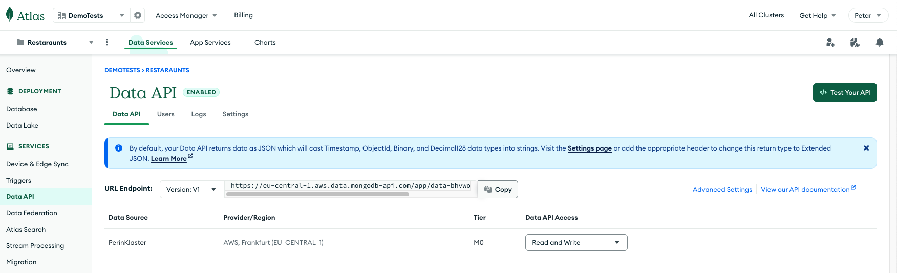
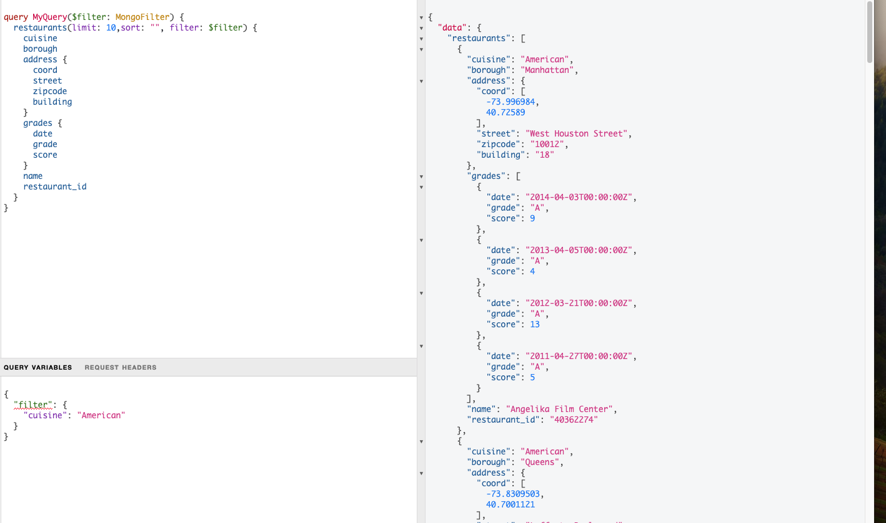

# StepZen Weather API addon 

[Weather API](https://www.weatherapi.com/) is api where you can get current, historical or  forecasted weather stats(temperature, air quality index, wind speed etc.) filtered by city name or geo location coordinates.

There is 14 days trial account and credit card isn't needed.

In this example we are converting current weather api with Stepzen introspection feature into graphql api.

*weather/index.graphql* - powerful Stepzen [transform](https://www.ibm.com/docs/en/api-connect/ace/1.x?topic=types-input-transform) function, graphql query is being modified and now there is new entry "coordinates" : { lat,long } using the "location" field from root call.
This is only one example of Stepzen transform capabilities.

*curl/index.graphql* - Stepzen materializer.
Here  is graphql call returning list of customers and customers' orders.
Address is extended with weather query materializer.
Now we can get weather for each customer location order and check if some of them are late because of storm.

Maybe historical weather api with exact time is better for this use case.
Current weather suits within actual orders and tracking observability,
where forecasted weather graphql can be used to give drivers extra tips and motivate them work.

All of these can be mixed and included easily with Stepzen integration capabilities and frontend developers can provide unique experience to their shipping services.

> **_NOTE:_** We keep secrets such as api keys in config.yaml file, config.yaml file shouldn't be uploaded to git but for this purpose you can use any key exposed.

> **_NOTE:_**  All of those index.graphql files are generated with stepzen import curl command

## MONGODB

Please follow this official [stepzen tutorial](https://github.com/stepzen-dev/examples/tree/main/with-mongodb-atlas#set-up-mongodb) to setup MongoDB cluster.

> **_NOTE:_**  You will need to enable Data API.

In this tutorial (mongodb available sample datasets)[https://www.mongodb.com/docs/atlas/sample-data/#available-sample-datasets] will be loaded.

### (Restaurants dataset)[https://www.mongodb.com/docs/atlas/sample-data/sample-restaurants/#std-label-sample-restaurants]

We will use mongodb Data API and transform it with StepZen.

In [mongo_restaurants](./mongo_restaurants/index.graphql) we define types such as Grade, Restaraunt_Address and Restaraunt.

You can see that in this example in query we are using mongodb find query, and that wee need to provide api-key( defined under config.yaml).

If we start StepZen we can run various queries.

i.e. this [query](./mongo_restaurants/query-Americans.txt) will use Mongo filter to filter only American cuisine restaurants - [output](./mongo_restaurants/query-Americans.json).

You can use all of mongo query features such as limit,sort etc.

Here we can add filter: "cuisine==\"American\"" to our Query and it will filter restaurants by cuisine on api level, database filter will not be included.

Now we can even include weather for our restaurants (using @materializer directive with address.coord and weather api), get mean restaurant score(using @ecmascript or @jsonata) etc.

### (Airbnb dataset)[https://www.mongodb.com/docs/atlas/sample-data/sample-airbnb/#std-label-sample-airbnb]

Under [mongo_bnb](./mongo_bnb/sample_mongo.graphql) we define types such as Review, Host, Listing.

Again, we can use mongo filter to find any kind of accommodation, but in this example with api-level filter: "beds > 2 && number_of_reviews > 50" , we are interesting only in ones that have more then 2 bads and many reviews.

Here we can also apply various kind of filtering and sorting - using ecmascript or jsonata.

IDEA(ADVANCED): maybe you can try to join airbnb and restaurants and 3rd party location api to get closest restaurant to chosen accommodation . 

